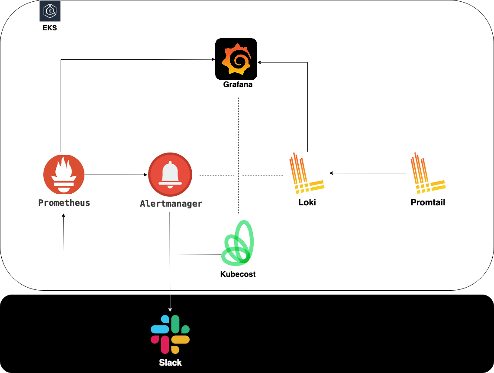
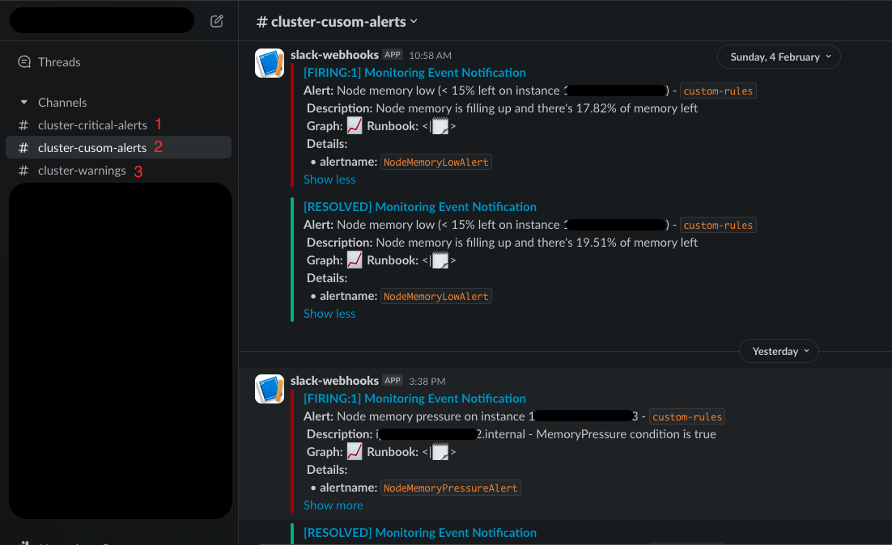
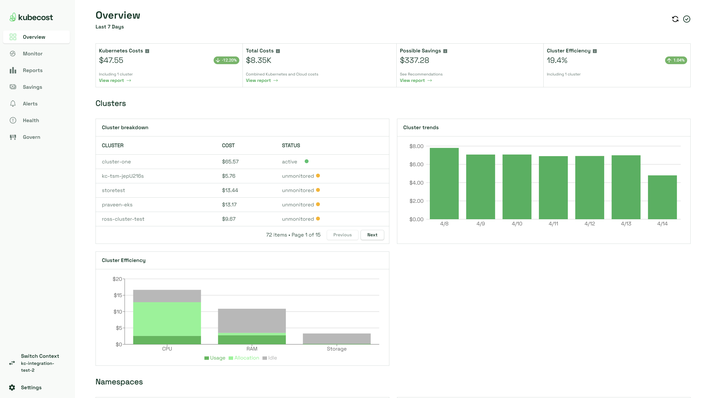
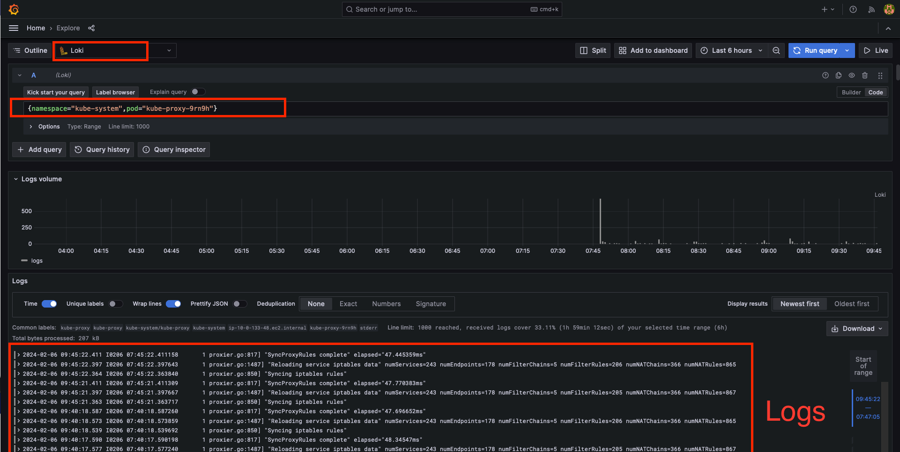

# Complete Monitoring & Logging Stack For K8s Cluster:

## Here is a complete guide to install:

- **Monitoring Stack**: Using Prometheus, Alertmanager, Kubecost and Grafana

- **Logging Stack**: Using Loki and Promtail

## :arrow_right: Monitoring Stack:
In this tutorial we will use [kube-prometheus-stack](https://artifacthub.io/packages/helm/prometheus-community/kube-prometheus-stack) Helm chart to install 

- `Prometheus` for collecting and storing metrics
- `Alertmanager` for handling alerts sent by our Prometheus server
- `Grafana` for visualizing our data with beautiful dashboards

Then we will use [cost-analyzer](https://artifacthub.io/packages/helm/kubecost/cost-analyzer) Helm chart to install 

- `Kubecost` for providing real-time cost visibility and insights for teams using and helping us continuously reduce our cloud costs

### :small_blue_diamond: Let's start first by [kube-prometheus-stack](https://artifacthub.io/packages/helm/prometheus-community/kube-prometheus-stack) Helm chart:

###### :one: Add the chart repo 

        helm repo add prometheus-community https://prometheus-community.github.io/helm-charts
###### :two: Pull the chart to our local machine to start creating our custom `values.yaml` file

        helm pull prometheus-community/kube-prometheus-stack

###### :three: Prerequisites before moving forward with our custom `values.yaml` file

- Create persistence for Prometheus, Alertmanager and Grafana in `volumes.yaml` file
  
  You can find it [here](https://github.com/El-Zedy/Monitoring-Logging-Stack/blob/main/Monitoring/kube-prometheus-stack/volumes.yaml)
  Then apply it using these commands:
  
        kubectl create ns monitoring-logging
        kubectl apply -f volumes.yaml

  - **Hints**: 

    - PV and PVC above we will use them for grafana and StorageClass for promethus and alertmanager.
    - In my case i used EFS as persistent volume for my AWS EKS cluster

- Create ingress for grafana in ingress.yaml file

  You can find it [here](https://github.com/El-Zedy/Monitoring-Logging-Stack/blob/main/Monitoring/kube-prometheus-stack/ingress.yaml)
  Then apply it using this command:
  
        kubectl apply -f ingress.yaml

- At this point we are ready to create our `values.yaml` for `Grafana`, `Prometheus` and `Alertmanager`

  You can find it [here](https://github.com/El-Zedy/Monitoring-Logging-Stack/blob/main/Monitoring/kube-prometheus-stack/values.yaml)
- At this point our values.yaml file is ready for using it with helm chart `install`

        helm upgrade --install <$RELEASE_NAME> prometheus-community/kube-prometheus-stack -f values.yaml -n monitoring-logging

###### :four: After install our monitoring stack and made sure that everything works fine, let's create another file for our `custom alerts` that will be sent to pre-configured `slack` channels

  You can find it [here](https://github.com/El-Zedy/Monitoring-Logging-Stack/blob/main/Monitoring/kube-prometheus-stack/alert-values.yaml)
  Then apply it using these commands:

        helm upgrade --install <$RELEASE_NAME> prometheus-community/kube-prometheus-stack --reuse-values -f alert-values.yaml -n monitoring-logging

      
*At this point we have `Prometheus`, `Alertmanager`, and `Grafana` all that's left is `Kubecost`*

- To access our `alertmanager` to view slack alerts:

      kubectl port-forward pod/<$ALERT-MANAGER_POD_NAME> <$ANY_PORT>:9093 -n monitoring-logging

- To access our `prometheus`:

      kubectl port-forward pod/<$PROMETHEUS_POD_NAME> <$ANY_PORT>:9090

*Reference for Grafana*: [Documentation](https://grafana.com/docs/grafana/latest/) - *Reference for Prometheus*: [Documentation](https://prometheus.io/docs/introduction/overview/) - *Reference for Alertmanager*: [Documentation](https://prometheus.io/docs/alerting/latest/alertmanager/)

#

### :small_blue_diamond: Now let's talk about Kubecost [cost-analyzer](https://artifacthub.io/packages/helm/kubecost/cost-analyzer) Helm chart installation:
                
- __`KubeCost`__ provides real-time cost visibility and insights for teams using Kubernetes, helping you continuously reduce your cloud costs.

- __`KubeCost`__ supports Kubernetes running on **`AWS/EKS`**, **`Azure/AKS`**, **`GCP/GKE`** and **`on-prem`**. We provide best-efforts support for other cloud platforms.

##### - First way :arrow_right_hook: __`KubeCost`__ can be installed as an __`EKS-ADD-ON`__:

- Pros: Ease of installation.

- Cons: Hard to be configured.

##### - Second way :arrow_right_hook: __`KubeCost`__ can be installed using __`Helm chart`__:

- Pros: Harder installation (but still not too hard).

- Cons: Easy to be configured.

###### :one: Add the chart repo 

     helm repo add kubecost https://kubecost.github.io/cost-analyzer

###### :two: Pull the chart to our local machine to start creating our custom `values.yaml` file

     helm pull kubecost/cost-analyzer --version <$VERSION> (specify the helm chart version you want to install).

- At this point we are ready to create our `values.yaml` for `Kubecost`.

  You can find it [here](https://github.com/El-Zedy/Monitoring-Logging-Stack/blob/main/Monitoring/Kubecost/values.yaml)
  
- At this point our values.yaml file is ready for using it with helm chart `install`

        helm upgrade --install <$RELEASE_NAME> kubecost/cost-analyzer --reuse-values -f values.yaml -n monitoring-logging

- To access our `kubecost`:

        kubectl port-forward pod/<$COST-ANALYZER_POD_NAME> <$ANY_PORT>:9090 -n monitoring-logging

- **Hints**: 

    - You can use persistent volume (EFS || EBS) for persisting kubecost data, but if you are already persisting your prometheus then actually you do not need to persist your kubecost.

    - There are alert configuration in the helm chart values.yaml, you can send alerts to slack, teams or even emails and you can configure the alerts to monitor the cost, cluster health, kubecost health, etc ...

*Reference for installing Kubecost*: [Link for installing kubecost](https://docs.kubecost.com/install-and-configure/install) - *Reference for using custom Prometheus with Kubecost*: [Link for using custom Prometheus with KubeCost](https://docs.kubecost.com/install-and-configure/install/custom-prom)

#

## :arrow_right: Logging Stack:

For logging stack we will use [loki-stack](https://artifacthub.io/packages/helm/grafana/loki-stack) Helm chart to install 

- `Loki` (LogQL) for storing and querying logs
- `Promtail` for collecting and sending logs to Loki

###### :one: Add the chart repo 

        helm repo add grafana https://grafana.github.io/helm-charts
###### :two: Pull the chart to our local machine to start creating our custom `values.yaml` file

       helm pull grafana/loki-stack
###### :three: From the previous steps loki persistence volume already created and we are ready to create its `values.yaml` file

You can find it [here](https://github.com/El-Zedy/Monitoring-Logging-Stack/blob/main/Logging/values.yaml)
Then apply it using these commands:

      helm upgrade --install <$RELEASE_NAME> grafana/loki-stack -f values.yaml

 

*Reference for Loki and Promtail*: [Documentation](https://grafana.com/docs/loki/latest/)

## Now our stack up and running :dancer: :dancer: :dancer: :dancer: :dancer: :dancer: 

        Kubectl get all -n monitoring-logging

#

## Conclusion

In conclusion, this comprehensive guide provides a step-by-step walkthrough for setting up a complete Monitoring & Logging Stack for a Kubernetes Cluster. By following the outlined instructions, users can deploy and configure essential components such as Prometheus, Alertmanager, Grafana, Loki, and Promtail, along with the Kubecost for real-time cost visibility.

The guide emphasizes the importance of creating persistence for Prometheus, Alertmanager, and Grafana, using volumes.yaml, and showcases the configuration steps for ingresses and custom alert values. The incorporation of Kubecost adds a layer of cost monitoring and efficiency to the Kubernetes environment, allowing teams to optimize cloud costs continuously.

Additionally, the Logging Stack implementation with Loki and Promtail is seamlessly integrated into the overall setup, enhancing the ability to store, query, and visualize logs efficiently.

### Contributing:

Contributions to this project are welcome and appreciated. To contribute, please follow these steps:

1. Fork the repository to your own account.
2. Create a new branch for your changes.
3. Make your changes and commit them to your branch.
4. Create a pull request to merge your changes into the main branch.

### Acknowledgements:

Special thanks to the following organizations and individuals for their contributions and support to the Monitoring & Logging Stack project:

- Prometheus Community: The Prometheus community provides essential tools for monitoring and alerting, and their Helm chart (kube-prometheus-stack) is a core component of this setup.

- Kubecost: The Kubecost project offers real-time cost visibility and insights for Kubernetes, supporting various cloud platforms. The Helm chart (cost-analyzer) from Kubecost simplifies the installation and configuration process.

- Grafana: Grafana's Helm chart (loki-stack) is instrumental in setting up the Logging Stack, providing Loki for log storage and Promtail for log collection.

- GitHub: GitHub serves as the collaborative platform for hosting and managing the Monitoring & Logging Stack project. The contribution workflow and version control provided by GitHub greatly facilitate the development process.

- [Muhammad Gamal](https://github.com/muhammedgamal760) & [Ahmed Khaled](https://github.com/ahmedKhaled1995): Dedicated contributors to the project, have substantially improved the quality and success of the Monitoring & Logging Stack setup through their teamwork and valuable contributions.

### Contact:

For any questions, suggestions, or feedback regarding this project, feel free to contact the project owner at:

- Muhammad Elzedy: muhammadhassanelzedy@gmail.com
- Muhammad Gamal: muhammedgamal760@gmail.com
- Ahmed Khaled: ahmedKhaled1995@gmail.com

